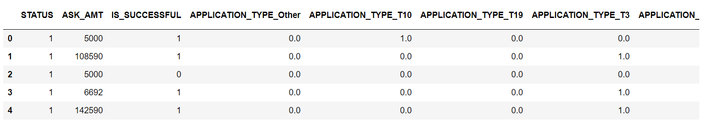
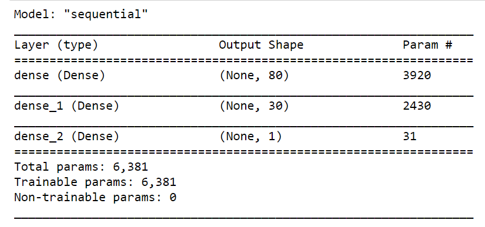
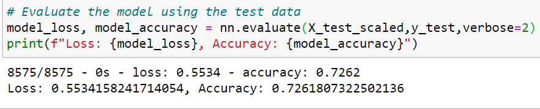

# Neural_Network
Machine Learning Neural Network
## Project Overview
The project requires us to create a binary classifier (Neural Network model) that is capable of predicting whether or not an applicant will be successful if funded by company using the features collected in the provided dataset.
## Resources
- Data Source: charity_data.csv
- Software: Pandas, Scikit-learn library, Python ,tensorflow library and Jupyter notebook
## Challenge Overview
**1.Data Preprocessing:**

Once the data is loaded into the pandas dataframe , the data prepocessing steps include the following:

 a. Remove all the coulmns that are not required for the interpretation.
 b. Combine the categorical value via bucketing.
 c. The coulmns with the text values are encoded to their coresponding integer label using OneHotEncoder.
 

**2. Tensorflow Neural Network Model:**

The neural Network model that was built had two hidden layers with the 80 neurons in the first layer and the 30 neurons in the second layers. The flowing images shows the param value for the model.

**3. Accuracy Results:**
The model was trained for 100 epochs and the accuracy for the model was approximately 72%. 

## Challenge Summary
**How many neurons and layers did you select for your neural network model? Why?**

A good rule of thumb for a basic neural network is to have two to three times the amount of neurons in the hidden layer as the number of inputs. It is not a good practice to go over 3 hidden layer.The neurons selected in the first layer and second layer was 80 and 30 repectively. The neural network model had two hidden layers.

**Were you able to achieve the target model performance? What steps did you take to try and increase model performance?**

No, the neural network model model was not able to achieve the target model performance .The model accuracy achieved was 0.7262. 
The steps taken to increase the model performance:

**a. Add more neurons to a hidden layer.** The increase of the number of neuron from 80 to 100 did not yield any change in the performance . The accuracy still remained around 0.72

**b.Add additional hidden layers.** The increase in the number of layers also did not improve the accuracy of the model.

**c.Use a different activation function for the hidden layers.** The change in the activation function also did not change the perfomance . It went lower to 0.53 . The model was at the accuracy of 0.72 with "RELU" activation function in the input layer and "Sigmoid" function for the output layer.

**d.Add additional epochs to the training regimen.** The change of the epochs from 50 to 500 did not increse the perfomance . The model accuracy was still at 0.72 .

**e.Modify the bucketing of the Application type and Classification:** We did try to change the bucket size varying from 104 to highest 1883 . Regardless, the resuts of the model accuracy was still around 0.72.

**If you were to implement a different model to solve this classification problem, which would you choose? Why?**

**Random Forest** works good with the tabular data. The Random Forests requires less preprocessing and the training process is simpler. The Random Forest is the ensemble of decision trees. Each decision tree, in the ensemble, process the sample and predicts the output label (in case of classification). Decision trees in the ensemble are independent. Each can predict the final response.  Hence, the different model to solve this classification problem would be Random Forest.
